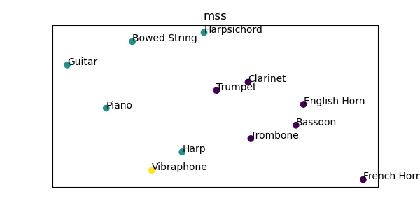

# kymatio-audio

A repository for audio related processing tools based on the [kymatio](https://www.kymat.io) library.

The scattering audio distance (SAD) aims at providing an 'artificial ear' i.e. a computational proxy for assessing the auditory distance between two sounds.

Main advantages of the SAD:
 - conceptual equivalence to modern physiological models of the first layers of the human auditory system
 - strong mathematical grounding
 - controllable levels of invariance at each layers

## Compute the SAD

```
from kymatio_audio import scattering_audio_distance as sad

scattering_distances = sad.scattering_audio_distance(audio, sampling_rate)
```
where `audio` is a list of 1d arrays with audio sampled at the same `sampling_rate`, and `scattering_distances` is a square and symmetric matrix of pairwise SAD distances.

## Demonstrations

A series of jupyter notebooks are available for demonstrating the potential of the SAD with respect to the Multi-Scale Spectral (MSS) Loss. See the [notebooks](notebooks/) directory.

For each demonstration
 - a set of sounds is considered
 - the MSS and the SAD distances are computed for every pairs
 - a multidimensional scaling is done to project the sounds on a 2d plane for visual inspection.

### Noise resilience

In this experiment, we consider two vowels an *a* and a *i* that is buried in white noise of decreasing level. It is expected that on the 2d plane, the sounds with the *a* and *i* are far apart and the ones with the lower SNR are closer to each other than the ones with high SNR. [listen](assets/noise.wav)


MSS and SAD perform similarly in this case, which is expected since no modulations are involved for discriminability.

### Vocalic triangle

In this experiment, we consider a set of vowels recorded by [Bruce P. Hayes](https://linguistics.ucla.edu/people/hayes), made available [here](https://linguistics.ucla.edu/people/hayes/103/Charts/VChart). The audio data as well as the reference chart below are used with permission. Please [listen](assets/vowel.wav) to the set of vowels sequenced from *i* to *u*.


While the MSS retrieves correctly organization along the first formant, the SAD retrieves it better along the second formant, achieving an organization close to the reference vocalic triangle.

### McAdams Timbre dataset

In this experiment, we consider the set of synthesized musical timbre considered in the pioneering [work](https://www.mcgill.ca/mpcl/files/mpcl/mcadams_1995_psycholres.pdf) of Stephen McAdams. Please [listen](assets/mcadams.wav) to the set of sounds considered, where the hybrid instruments considered in the original study have been removed.




Both MSS and SAD nicely distinguishes between the idiophone (yellow), the cordophones (green) and the aerophones (purple).

### Musical Instruments, invariance to pich

In this experiment, we consider recordings of three musical instruments (Trumpet, Violin, Flute) played *ordinario* for all pitches of octave 4, taken from [OrchideaSol](https://forum.ircam.fr/projects/detail/orchideasol/), ([listen](assets/instrument.wav)).


On those displays, the larger the dot, the higher the pitch. While the MSS defines clear instrument clusters, SAD achieves somewhat greater separation, indicating higher invariance to pitch.

### Musical instruments, sensitivity to the playing technique

In this experiment, we consider recordings of a Violin played *ordinario* (with slight vibrato) and *tremolo* (played by moving the bow back and forth) for all pitches of octave 4, taken from [OrchideaSol](https://forum.ircam.fr/projects/detail/orchideasol/), ([listen](assets/.wav))


On those displays, the larger the dot, the higher the pitch. As the Fourier transforms of the MSS do not explicitly model modulations along the time and frequency, the MSS fails to distinguish between the two playing techniques. On contrary, the SAD exhibit a large separation and progressive displacement with respect to pitch change.

<!-- ### 

In this experiment, we consider . [listen](assets/texture.wav)


 -->

## Future work:
 - include the experiment on texture
 - use audio type for determining the kymatio frontend
 - provide a series of default parametrizations for standard tasks
